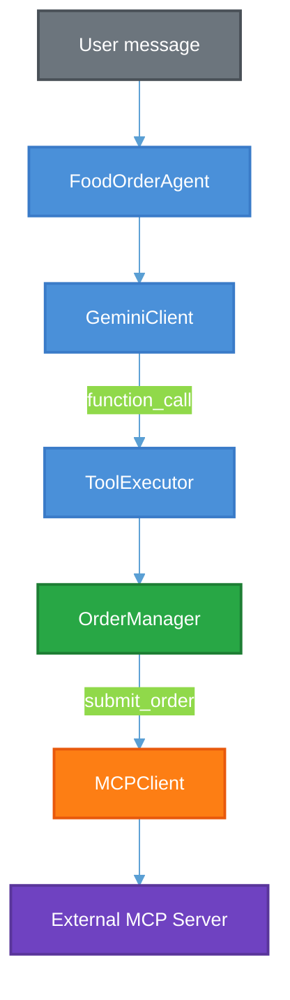
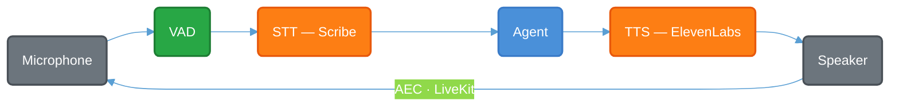

# Food Order Agent

A conversational food ordering chatbot that handles the full order lifecycle through natural language. You talk to it, it figures out what you want, manages your order, and submits it to an external MCP server when you're ready. It runs in two modes: a text CLI with Rich formatting and a fully hands-free voice mode with speech recognition and synthesis.

Built with Gemini 2.5 Flash for intent understanding and response generation, but all order logic (validation, pricing, state) is deterministic Python. The LLM never calculates prices or mutates state directly.

---

## Quick Start

**Prerequisites:** Python 3.11+, [conda](https://docs.conda.io/en/latest/miniconda.html), and [uv](https://docs.astral.sh/uv/getting-started/installation/)

```bash
# 1. Clone and enter the repo
git clone https://github.com/nkarnik/food-order-agent.git
cd food-order-agent

# 2. Create and activate a virtual environment
conda create -n food python=3.11.15 -y
conda activate food

# 3. Install dependencies
uv pip install -e .

# 4. Set up environment variables
cp .env.example .env
```

Open `.env` and fill in your keys:

```
GEMINI_API_KEY=<your key from aistudio.google.com>
APPLICANT_EMAIL=<your email>
```

Run it:

```bash
python main.py
```

That's it. You'll get a Rich-formatted CLI where you can start ordering food.

---

## Voice Mode Setup

Voice mode adds speech-to-text and text-to-speech via ElevenLabs, voice activity detection via webrtcvad, and acoustic echo cancellation via LiveKit. These are optional dependencies and the text CLI works without them.

```bash
# Install voice + observability extras
uv pip install -e ".[all]"
```

You'll also need PortAudio on your system (the `sounddevice` library depends on it):

```bash
# macOS
brew install portaudio

# Linux (Debian/Ubuntu)
sudo apt-get install libportaudio2
```

Add your ElevenLabs API key to `.env`:

```
ELEVENLABS_API_KEY=<your key from elevenlabs.io>
```

Then:

```bash
python main.py --voice
```

Voice mode is fully hands-free. No keyboard interaction needed. You speak naturally, the agent responds through your speakers, and it listens for your next utterance automatically. Say "goodbye" or "exit" to end the session. A latency summary (avg/P95 for STT, agent processing, TTS, and total turn latency) is printed when you exit.

### Barge-in (interrupting the agent)

By default, barge-in is **disabled**. The agent finishes speaking before listening again. This is the most reliable mode and what I'd recommend for a first run.

To enable it, open `config/agent.yaml` and set:

```yaml
voice:
  enable_barge_in: true
```

When barge-in is on, you can interrupt the agent mid-sentence. The implementation uses acoustic echo cancellation (LiveKit WebRTC AEC3) to subtract the agent's own speaker output from the mic signal, so the voice activity detector only fires on actual user speech, not on the agent's voice coming through the speakers.

**Important:** The AEC pipeline is designed for **speaker output** (laptop speakers, external speakers), not headphones. With headphones there's no echo leaking into the mic, so the echo cancellation path has nothing to work with. If you're testing barge-in, use speakers.

---

## Usage

### Text CLI

```bash
python main.py
```

Set `VERBOSE=1` to see which tools the LLM calls on each turn. Set `log_level: DEBUG` in `config/agent.yaml` to see full conversation turn logs (user message, tool calls, response):

```bash
VERBOSE=1 python main.py
```

Example conversation:

```
You: I'd like a large classic burger with cheese and bacon
Assistant: Added a large Classic Burger with cheese and bacon to your order ($13.00). Anything else?

You: And medium fries
Assistant: Added French Fries to your order ($3.50). Anything else?

You: That's it
Assistant:
  1. Classic Burger (size: large, patty: beef) + cheese, bacon x1  $13.00
  2. French Fries (size: medium) x1  $3.50
  Total: $16.50

Ready to submit?

You: Yes
Assistant: Your order has been placed!
Order ID: ORD-48271
Total: $16.50
Estimated time: 15-20 minutes
```

The agent handles modifications ("make it large", "remove the bacon", "actually change it to chicken"), removals ("remove the fries"), multiple items in one message ("a burger, fries, and a cola"), special instructions ("no onions please"), and ambiguity resolution (if you say "burger" and two types exist, it asks which one).

### Programmatic API

```python
from agent import FoodOrderAgent

agent = FoodOrderAgent()

response = agent.send("I want a large burger with cheese")
print(response["message"])
# "Added a large Classic Burger with cheese to your order ($11.50). Anything else?"

response = agent.send("Actually make it regular")
print(response["message"])
# "Updated your Classic Burger to regular ($9.50). Anything else?"

response = agent.send("That's it")
# Shows order summary, asks to confirm

response = agent.send("Yes")
# Submits via MCP, returns order ID + total + estimated time

agent.shutdown()
```

The `send()` method returns a dict:

```python
{
  "message": str,         # The agent's response text
  "tool_calls": [         # Present only when MCP tools were called (submit_order)
    {
      "name": str,        # Tool name
      "arguments": dict,  # Arguments passed
      "result": dict      # Server response
    }
  ]
}
```

Most turns only return `{"message": "..."}`. The `tool_calls` key appears when `submit_order` is invoked and includes the MCP server's response (order ID, total, estimated time on success; error message on failure).

---

## The Menu

Seven items across four categories. Defined in `data/menu.yaml`.


| Category | Item                  | Base Price | Options                                                              |
| -------- | --------------------- | ---------- | -------------------------------------------------------------------- |
| Burgers  | Classic Burger        | $8.50      | size (regular/large), patty (beef/chicken/veggie)                    |
| Burgers  | Spicy Jalapeno Burger | $9.50      | size (regular/large), spice level (mild/medium/hot/extra hot)        |
| Pizzas   | Margherita Pizza      | $12.00     | size (small/medium/large), crust (thin/regular/thick)                |
| Sides    | French Fries          | $3.50      | size (small/medium/large)                                            |
| Sides    | Onion Rings           | $4.50      | size (small/medium/large)                                            |
| Drinks   | Soft Drink            | $2.00      | size (small/medium/large), flavor (cola/diet cola/lemon lime/orange) |
| Drinks   | Milkshake             | $5.50      | size (regular/large), flavor (vanilla/chocolate/strawberry/oreo)     |


Each item has optional extras (cheese, bacon, avocado, truffle oil, whipped cream, etc.) with their own prices. Size options modify the base price (e.g., large burger adds $2.00, small pizza subtracts $2.00).

---

## How It Works



| Component | Role |
|-----------|------|
| **FoodOrderAgent** | Orchestrator: manages history, confirmation state, MCP gating |
| **GeminiClient** | Tool-calling loop: sends message + history + tools to Gemini, iterates until model returns text |
| **ToolExecutor** | Dispatches `function_call` to OrderManager, returns result dicts |
| **OrderManager** | Deterministic: validates against menu, calculates prices, mutates state |
| **MCPClient** | HTTP submission with exponential backoff retry (triggered by `submit_order` sentinel) |

The agent doesn't use an agentic framework (LangChain, LangGraph, CrewAI). The action space is 9 well-defined tools. A dispatch table with direct Gemini function calling is simpler to test and debug than a graph framework.

### Voice Pipeline



The voice session runs a continuous loop reading 20ms mic frames and running VAD. It never blocks for more than one frame, so barge-in detection stays responsive even while the agent is processing. TTS uses sentence-level streaming: the first sentence starts playing as soon as it's synthesised while subsequent sentences are generated concurrently, so the user hears the response faster than if the entire text were synthesised in one shot.

---

## Design Decisions

### LLM as NLU, Not as Brain

The core design principle. The LLM (Gemini 2.5 Flash) has exactly two jobs:

1. **Intent extraction:** via function calling, the model picks which tool to call and fills in the arguments. This is slot-filling / NLU.
2. **Response generation:** after tools execute, the model produces a natural language reply.

Everything else is deterministic Python:

- **Pricing:** `OrderManager._calculate_unit_price()` computes `base_price + option modifiers + extras` from the menu schema. Prices are never LLM-generated.
- **Validation:** options and extras are checked against the menu before being accepted. Invalid choices get a clear error listing valid options.
- **State mutations:** add/modify/remove are thread-safe operations on Pydantic models behind a `threading.Lock`.
- **Confirmation gating:** `submit_order` is blocked until `confirm_order` has been called and the user explicitly approves.

This means the entire order pipeline is unit-testable without mocking or calling the LLM.

### MCP Submission: Sentinel Pattern

`submit_order` inside the LLM's tool-calling loop is a sentinel: it validates the order is non-empty and returns `{"status": "ready_to_submit"}`, but never touches the network. The actual MCP HTTP call happens *after* the loop returns, in `agent.py`.

Why bother? It keeps the tool loop pure (no side effects), lets the agent check confirmation state before submitting, and allows overriding the response text with real server data (order ID, total, estimated time) or generating a helpful error message on failure.

MCP calls use exponential backoff (3 attempts: immediate, +1s, +2s). `isError` responses from the server raise a `RuntimeError` to enter the retry loop. This was a bug fix: previously they returned immediately and bypassed retries entirely. On failure, `_awaiting_confirmation` stays `True` so the user can retry by just saying "yes" again.

### Hallucination Safeguard

After a failed MCP submission, the compressed history can lose tool-calling context. On the next "yes", the model sometimes generates "your order has been submitted!" from memory instead of actually calling `submit_order`. The agent catches this: if the response contains submission-related phrases but no real MCP call was made, it blocks the response and prompts the user to try again.

### History Compression

Each turn is compressed to `[user_message, final_model_text]`, dropping intermediate function calls and tool results. This cuts per-turn token cost by about 75%. It's safe because the order snapshot is re-injected fresh into the system prompt every turn, so the model always sees the real current state, never stale context from earlier turns.

### Thinking Budget = 0

Intentional, not an oversight. The LLM's role here is mechanical: pick a tool, fill in arguments, write a 1-2 sentence response. Gemini's extended thinking adds 200-500ms of latency with no measurable accuracy improvement for this kind of slot-filling task.

### Voice: Sentence-Level TTS Streaming

Instead of synthesising the entire response text as one chunk, the TTS component splits it into sentences and synthesises them one at a time. Playback starts as soon as the first sentence arrives; the rest synthesise concurrently. The user hears the first word after roughly one-sentence latency instead of full-response latency.

The sentence splitter handles edge cases like abbreviations (Mr., e.g.), price decimals ($10.50), and long clauses (split at commas when a sentence exceeds 120 characters). Prices are normalised for speech: `$12.50` becomes "12 dollars and 50 cents".

### Voice: Acoustic Echo Cancellation

The barge-in feature needs to distinguish between the user speaking and the agent's own voice playing through the speakers. LiveKit's WebRTC AudioProcessingModule (AEC3 + noise suppression + high-pass filter) handles this. The speaker reference signal is captured from the playback callback and fed frame-by-frame to the echo canceller. A 300ms post-playback cooldown drains residual echo from the mic buffer.

### In-Memory State

Order state and conversation history live in memory for the session lifetime. In a multi-instance deployment, session state would move to Redis, and submitted orders would be persisted to a database for auditability. For this scope, the MCP server owns the order record post-submission. You call `submit_order`, get back an `order_id`, and that's it. No local persistence needed.

### What I'd Build Next

Things I'd add for a production deployment but intentionally left out here since they weren't asked for:

- **Order history persistence:** right now submitted orders live only on the MCP server. A local record (Postgres, Firestore) would enable "what did I order last time?", analytics, dispute resolution, and resilience against lost MCP responses.
- **Session persistence:** Redis-backed session state for multi-instance / load-balanced deployments. Currently each process holds its own in-memory state.
- **Response streaming:** stream the final text response from Gemini instead of waiting for the full generation. Saves ~200-400ms per turn. Table stakes for a web UI, marginal for CLI.
- **Headphone-aware barge-in:** the current AEC pipeline assumes speakers. With headphones there's no echo to cancel, so you'd skip AEC and run VAD directly on the raw mic signal. Could auto-detect based on audio routing.
- **Multi-language support:** the menu and prompts are English-only. The architecture (LLM as NLU + deterministic backend) would generalise well. The menu model and pricing logic are language-agnostic, only the prompt and TTS voice would need per-language variants.

---

## Testing

Three tiers with increasing external dependencies:

```bash
# Unit tests (no API keys, no network, fast)
uv run pytest tests/unit/ -v

# Integration tests (needs APPLICANT_EMAIL + network, hits the real MCP server)
uv run pytest tests/integration/ -v

# E2E tests (needs GEMINI_API_KEY + APPLICANT_EMAIL, full conversations through the live agent)
uv run pytest tests/e2e/ -v
```

Unit tests cover `OrderManager` (add/modify/remove, validation, pricing), `ToolExecutor` (dispatch, error handling), menu model parsing, TTS normalisation, sentence splitting, VAD state machine, voice session state transitions, fallback responses for all 9 tools, and the Langfuse no-op path.

Scenario-based eval:

```bash
python scripts/run_eval.py
```

Runs 7 scenarios from `data/test_scenarios.yaml`: simple orders, modifications, removals, empty-order edge cases, cancel-and-restart, off-topic messages, and view-order flows. Checks expected tool calls, item counts, totals, and error handling.

Linting:

```bash
uv run ruff check .
```

CI runs lint (Ruff) and unit tests on Python 3.11 and 3.12 via GitHub Actions on every push and PR.

---

## Observability (Optional)

The agent has optional [Langfuse](https://langfuse.com/) integration for LLM tracing. When the `langfuse` package is installed and the keys are set, every conversation turn is traced with spans for Gemini API calls, tool executions, and MCP submissions, including token usage and model parameters.

When Langfuse isn't installed or the keys aren't set, all observability exports become no-ops with zero overhead. No code changes needed.

To enable:

```bash
uv pip install -e ".[all]"   # includes langfuse
```

Add to `.env`:

```
LANGFUSE_PUBLIC_KEY=<your key>
LANGFUSE_SECRET_KEY=<your key>
LANGFUSE_HOST=https://cloud.langfuse.com
```

---

## Docker

```bash
docker build -t food-order-agent .

# Text mode
docker run -e GEMINI_API_KEY="$GEMINI_API_KEY" -e APPLICANT_EMAIL="$APPLICANT_EMAIL" -it food-order-agent

# Voice mode (Linux, needs audio device access)
docker run --device /dev/snd -e GEMINI_API_KEY="$GEMINI_API_KEY" -e APPLICANT_EMAIL="$APPLICANT_EMAIL" -e ELEVENLABS_API_KEY="$ELEVENLABS_API_KEY" -it food-order-agent python main.py --voice
```

**Voice mode requires host audio device access** (`--device /dev/snd`), which only works on **Linux**. Docker Desktop for macOS and Windows cannot pass through audio hardware. See the experimental workaround below, or run `python main.py --voice` natively instead.

### macOS Docker Voice Mode (Experimental)

Docker Desktop for macOS can't expose audio devices directly. As a workaround, you can run PulseAudio on the host and route audio from the container over TCP.

**1. Install and start PulseAudio on your Mac:**

```bash
brew install pulseaudio

# Start the daemon with TCP enabled (accepts connections from Docker containers)
pulseaudio --load="module-native-protocol-tcp auth-anonymous=1" --exit-idle-time=-1 --daemon
```

**2. Run the container with `PULSE_SERVER` pointing to the host:**

```bash
docker run -e PULSE_SERVER=host.docker.internal -e GEMINI_API_KEY="$GEMINI_API_KEY" -e APPLICANT_EMAIL="$APPLICANT_EMAIL" -e ELEVENLABS_API_KEY="$ELEVENLABS_API_KEY" -it food-order-agent python main.py --voice
```

When `PULSE_SERVER` is set, the entrypoint script configures ALSA inside the container to route through PulseAudio over TCP. On Linux with `--device /dev/snd`, this is skipped and ALSA talks directly to hardware.

**Caveats:** This adds audio latency compared to native, and PulseAudio on macOS can be finicky. If it doesn't work, run voice mode natively. It's more reliable.

To stop PulseAudio when you're done:

```bash
pulseaudio --kill
```

The Dockerfile uses a multi-stage build with layer caching: dependencies are installed first (cached as long as `pyproject.toml` doesn't change), then the source code is copied and the local package is reinstalled with `--no-deps`.

---

## Project Structure

```
food-order-agent/
├── agent.py                      # FoodOrderAgent: orchestrator, history, MCP gating
├── main.py                       # CLI entrypoint (text + voice modes)
├── config/
│   └── agent.yaml                # All configuration (model, MCP, voice, VAD, AEC)
├── data/
│   ├── menu.yaml                 # Menu definition (source of truth for items + prices)
│   └── test_scenarios.yaml       # Eval scenarios
├── prompts/
│   └── v2/system.txt             # System prompt with {menu} and {order_snapshot} slots
├── orderbot/
│   ├── llm/
│   │   ├── base.py               # LLMClient ABC (swappable backend)
│   │   └── gemini.py             # GeminiClient: tool-calling loop, parallel execution
│   ├── models/
│   │   ├── menu.py               # Menu, MenuItem, MenuOptionConfig (Pydantic v2)
│   │   ├── order.py              # Order, OrderItem
│   │   └── intent.py             # ParsedIntent, IntentType
│   ├── order/
│   │   └── manager.py            # OrderManager: deterministic mutations + pricing
│   ├── tools/
│   │   ├── declarations.py       # 9 Gemini FunctionDeclarations
│   │   └── executor.py           # ToolExecutor: dispatches tool calls to OrderManager
│   ├── mcp/
│   │   └── client.py             # MCPClient: MCP SDK streamablehttp + retry
│   ├── utils/
│   │   ├── config.py             # YAML + env var config loading (DotDict)
│   │   ├── logger.py             # structlog per-turn logging
│   │   └── observability.py      # Langfuse integration (no-op when disabled)
│   └── voice/
│       ├── session.py            # VoiceSession: state machine orchestrator
│       ├── vad.py                # WebRTCVAD: speech detection with hysteresis
│       ├── stt.py                # ElevenLabs STT (Scribe)
│       ├── tts.py                # ElevenLabs TTS: sentence-level streaming
│       ├── aec.py                # Echo cancellation (LiveKit WebRTC APM)
│       ├── audio_capture.py      # Microphone input (sounddevice)
│       ├── audio_playback.py     # Speaker output (sounddevice)
│       ├── metrics.py            # Per-turn latency tracking
│       └── models.py             # VoiceConfig, VoiceState, TurnTimings
├── tests/
│   ├── unit/                     # 10 test files, no API keys needed
│   ├── integration/              # MCP submission (live server)
│   └── e2e/                      # Full conversation flows (live LLM + MCP)
├── scripts/
│   └── run_eval.py               # Scenario-based eval runner
├── Dockerfile
├── pyproject.toml
└── DESIGN.md                     # Full architecture deep dive
```

For component internals, state machine specs, data flow diagrams, and trade-off tables, see [DESIGN.md](docs/DESIGN.md).