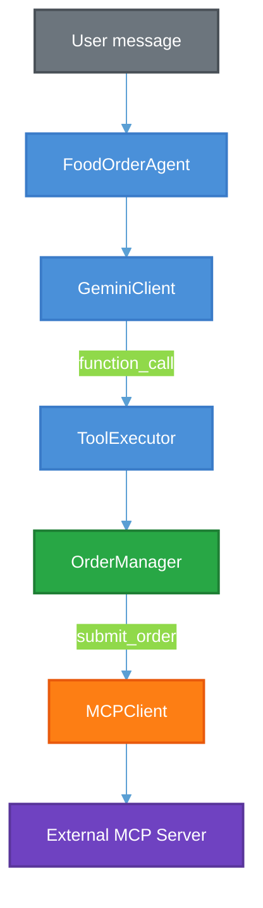
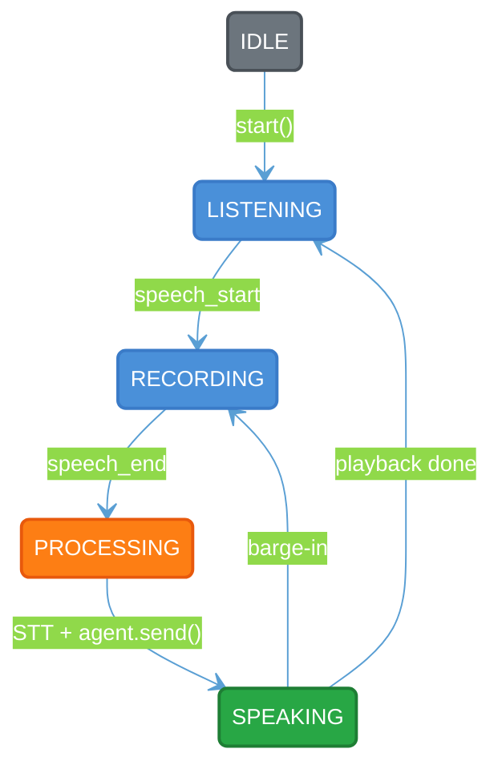

# Design Document: Food Order Agent


## Table of Contents

- [1. System Overview](#1-system-overview)
- [2. Architecture](#2-architecture)
  - [2.1 Core Data Flow](#21-core-data-flow)
  - [2.2 Module Dependency Graph](#22-module-dependency-graph)
- [3. Core Design Principle: LLM as NLU, Not as Brain](#3-core-design-principle-llm-as-nlu-not-as-brain)
- [4. Component Deep Dive](#4-component-deep-dive)
  - [4.1 FoodOrderAgent (agent.py)](#41-foodorderagent-agentpy)
  - [4.2 GeminiClient (orderbot/llm/gemini.py)](#42-geminiclient-orderbotllmgeminipy)
  - [4.3 OrderManager (orderbot/order/manager.py)](#43-ordermanager-orderbotordermanagerpy)
  - [4.4 ToolExecutor (orderbot/tools/executor.py)](#44-toolexecutor-orderbottoolsexecutorpy)
  - [4.5 Tool Declarations (orderbot/tools/declarations.py)](#45-tool-declarations-orderbottoolsdeclarationspy)
  - [4.6 MCPClient (orderbot/mcp/client.py)](#46-mcpclient-orderbotmcpclientpy)
- [5. Data Models](#5-data-models)
  - [5.1 Menu Models](#51-menu-models)
  - [5.2 Order Models](#52-order-models)
  - [5.3 Intent Model](#53-intent-model)
- [6. State Management](#6-state-management)
  - [6.1 Confirmation Gating](#61-confirmation-gating)
  - [6.2 History Compression](#62-history-compression)
  - [6.3 Order Snapshot Re-injection](#63-order-snapshot-re-injection)
- [7. MCP Submission Flow](#7-mcp-submission-flow)
  - [7.1 Sentinel Pattern](#71-sentinel-pattern)
  - [7.2 Retry Strategy](#72-retry-strategy)
  - [7.3 Error Recovery](#73-error-recovery)
  - [7.4 Hallucination Safeguard](#74-hallucination-safeguard)
- [8. Prompt Engineering](#8-prompt-engineering)
  - [8.1 System Prompt Design (v2)](#81-system-prompt-design-v2)
  - [8.2 Prompt Versioning](#82-prompt-versioning)
  - [8.3 Thinking Budget](#83-thinking-budget)
- [9. Voice Pipeline](#9-voice-pipeline)
  - [9.1 Architecture](#91-architecture)
  - [9.2 State Machine](#92-state-machine)
  - [9.3 Voice Activity Detection (VAD)](#93-voice-activity-detection-vad)
  - [9.4 Speech-to-Text (STT)](#94-speech-to-text-stt)
  - [9.5 Text-to-Speech (TTS)](#95-text-to-speech-tts)
  - [9.6 Acoustic Echo Cancellation (AEC)](#96-acoustic-echo-cancellation-aec)
  - [9.7 Audio I/O](#97-audio-io)
  - [9.8 Barge-In](#98-barge-in)
  - [9.9 Latency Metrics](#99-latency-metrics)
- [10. Tool System Design](#10-tool-system-design)
- [11. Pricing System](#11-pricing-system)
- [12. Observability](#12-observability)
- [13. Configuration](#13-configuration)
- [14. Error Handling & Resilience](#14-error-handling--resilience)
- [15. Testing Strategy](#15-testing-strategy)
- [16. CI/CD & Deployment](#16-cicd--deployment)

---

## 1. System Overview

A conversational food ordering agent that takes natural language input and manages a food order through its full lifecycle: browsing the menu, adding/modifying/removing items, confirming, and submitting to an external MCP server.

The system runs in two modes:

- **Text mode:** interactive Rich CLI (`python main.py`)
- **Voice mode:** hands-free mic/speaker conversation with VAD, STT, and TTS (`python main.py --voice`)

**Tech stack:** Python 3.11+, Gemini 2.5 Flash (function calling), ElevenLabs (STT/TTS), webrtcvad, LiveKit AEC, Pydantic v2, structlog, Langfuse, httpx, MCP SDK.

---

## 2. Architecture

### 2.1 Core Data Flow



| Component | Role |
|-----------|------|
| **FoodOrderAgent** (`agent.py`) | Orchestrator: owns history, confirmation state, MCP gating |
| **GeminiClient** (`llm/gemini.py`) | Tool-calling loop: user msg + history + tools to Gemini API, iterates until model returns text |
| **ToolExecutor** (`tools/executor.py`) | Dispatches tool calls to OrderManager, returns result dicts (never touches network) |
| **OrderManager** (`order/manager.py`) | Thread-safe, deterministic order mutations. Validates against Menu, calculates prices |
| **MCPClient** (`mcp/client.py`) | HTTP submission with exponential backoff. Uses MCP SDK's `streamablehttp_client` |

The agent doesn't use an agentic framework (LangChain, LangGraph, CrewAI). It uses Gemini's native function calling API directly. The action space is finite and well-defined. A simple dispatch table beats graph frameworks for testability and debuggability.

### 2.2 Module Dependency Graph

```
main.py
  └── agent.py (FoodOrderAgent)
        ├── orderbot/llm/gemini.py (GeminiClient)
        │     ├── orderbot/llm/base.py (LLMClient ABC)
        │     ├── orderbot/tools/declarations.py (ORDER_TOOLS)
        │     └── orderbot/utils/observability.py
        ├── orderbot/tools/executor.py (ToolExecutor)
        │     └── orderbot/order/manager.py (OrderManager)
        │           ├── orderbot/models/menu.py (Menu, MenuItem)
        │           └── orderbot/models/order.py (Order, OrderItem)
        ├── orderbot/mcp/client.py (MCPClient)
        ├── orderbot/models/menu.py (Menu)
        ├── orderbot/utils/config.py (load_configurations, DotDict)
        └── orderbot/utils/logger.py (ConversationLogger)

main.py --voice
  └── orderbot/voice/session.py (VoiceSession)
        ├── orderbot/voice/vad.py (WebRTCVAD)
        ├── orderbot/voice/stt.py (ElevenLabsSTT)
        ├── orderbot/voice/tts.py (ElevenLabsTTS)
        ├── orderbot/voice/aec.py (EchoCanceller)
        ├── orderbot/voice/audio_capture.py (AudioCapture)
        ├── orderbot/voice/audio_playback.py (AudioPlayback)
        ├── orderbot/voice/metrics.py (VoiceMetrics)
        └── orderbot/voice/models.py (VoiceConfig, VoiceState, TurnTimings)
```

---

## 3. Core Design Principle: LLM as NLU, Not as Brain

The LLM (Gemini 2.5 Flash) has exactly two jobs:

1. **Intent extraction:** via function calling, the model picks which tool to call and with what arguments (slot-filling). This is the NLU step.
2. **Response generation:** after tools execute, the model's final text turn produces a natural language reply.

Everything else is deterministic Python:


| Concern                 | Owner                                           | Why                                                |
| ----------------------- | ----------------------------------------------- | -------------------------------------------------- |
| Option/extra validation | `OrderManager._resolve_options()`               | Can't trust LLM to remember which extras are valid |
| Price calculation       | `OrderManager._calculate_unit_price()`          | Prices must never be hallucinated                  |
| State mutations         | `OrderManager.add_item/modify_item/remove_item` | Thread-safe, auditable                             |
| Confirmation gating     | `FoodOrderAgent._awaiting_confirmation`         | Prevents submission without review                 |
| MCP submission          | `FoodOrderAgent._run_turn()`                    | Sentinel pattern keeps network out of tool loop    |
| History management      | `FoodOrderAgent._compress_turn()`               | Token-efficient, deterministic                     |


This separation means the entire order pipeline is testable without mocking the LLM (unit tests cover `OrderManager` and `ToolExecutor` with no API calls).

---

## 4. Component Deep Dive

### 4.1 FoodOrderAgent (`agent.py`)

The public API and orchestrator. Responsible for:

- **Lifecycle management:** creates and wires all components, manages a persistent `asyncio` event loop for the synchronous `send()` API
- **History compression:** compresses each turn to `[user_msg, final_model_text]` (~75% token savings)
- **Confirmation state:** tracks `_awaiting_confirmation` flag; gates `submit_order` behind `confirm_order`
- **MCP submission:** detects the `submit_order` sentinel from `ToolExecutor`, performs the actual HTTP call via `MCPClient`, and overrides `result["text"]` with success/failure info
- **Hallucination safeguard:** if the model returns submission-related phrases without calling `submit_order`, the response is blocked and replaced with a retry prompt
- **History trimming:** hard cap of 20 turns (40 Content objects) to prevent unbounded token growth

Key design: history compression is deferred until *after* the MCP block so that `generate_mcp_error_response()` receives the clean, uncompressed `turn_additions` alongside the pre-turn `history`.

**Concurrency model:** `FoodOrderAgent.send()` is synchronous. It runs `asyncio.run_until_complete()` on a dedicated event loop created in `__init__`. This makes the agent easy to use from synchronous contexts (CLI, web frameworks) while keeping the internals async. The voice pipeline calls `agent.send()` via `asyncio.to_thread()` to avoid blocking the voice event loop.

### 4.2 GeminiClient (`orderbot/llm/gemini.py`)

Handles all Gemini API interaction:

- **Tool-calling loop:** sends user message + history + tools to Gemini; when the response contains function calls, executes them in parallel via `asyncio.gather()`, feeds results back, and repeats until the model returns text
- **Parallel tool execution:** multiple tool calls in a single model response are dispatched concurrently via `asyncio.to_thread()` (since `ToolExecutor.execute()` is synchronous)
- **Empty response retry:** if the model returns STOP with no content, retries up to `max_retries` times
- **MCP error response generation:** `generate_mcp_error_response()` replaces the sentinel tool result with the real MCP failure dict and does one more generate call, so the model can give actionable guidance (e.g., "try removing an item to get under the limit")
- **Fallback responses:** if `process_turn` fails entirely, returns a hardcoded fallback based on the last tool call's type
- **Langfuse instrumentation:** every `_generate()` call is wrapped in a Langfuse observation with model params, token usage, and input/output

Extends `LLMClient` ABC, making the LLM backend swappable.

**Configuration:**

- `temperature: 0.1` low creativity, high determinism for slot-filling
- `thinking_budget: 0` intentional; the LLM role is mechanical NLU, not reasoning. Thinking adds latency with no measurable gain for this task.

### 4.3 OrderManager (`orderbot/order/manager.py`)

Deterministic, thread-safe order state management:

- All mutations (`add_item`, `modify_item`, `remove_item`, `clear`) are guarded by a `threading.Lock`
- Validates all options and extras against the `Menu` model before accepting
- Applies defaults for unspecified options (e.g., size defaults to "regular")
- Calculates prices purely from the menu schema. `_calculate_unit_price()` sums `base_price + option_modifiers + extra_prices`
- Item targeting supports three resolution strategies: by `uid` (unique per order item), by `target_index` (0-based), by `item_id` (with disambiguation for duplicates), or fallback to last item added

Raises `OrderError` (custom exception) on validation failures, which `ToolExecutor` catches and returns as `{"error": ...}` dicts.

### 4.4 ToolExecutor (`orderbot/tools/executor.py`)

Bridges LLM tool calls to `OrderManager` operations:

- Uses `getattr(self, f"_exec_{tool_name}", None)` for dispatch. Simple, extensible pattern
- Each handler method translates tool arguments to `OrderManager` method calls
- Returns result dicts containing `status`, `item` (Pydantic model dump), and current `order` snapshot
- `submit_order` is a **sentinel**: it only runs `pre_submit_check()` and returns `{"status": "ready_to_submit"}`. The actual HTTP call lives in `agent.py`, *outside* the LLM tool-calling loop
- `confirm_order` generates a human-readable order summary with item details and total
- Catches `OrderError` and returns `{"error": str(e)}`, preventing exceptions from crashing the tool-calling loop

### 4.5 Tool Declarations (`orderbot/tools/declarations.py`)

Nine Gemini `FunctionDeclaration` objects packaged into a single `types.Tool`:


| Tool                       | Purpose                        | Required Args                         |
| -------------------------- | ------------------------------ | ------------------------------------- |
| `add_item`                 | Add a menu item                | `item_id`                             |
| `modify_item`              | Change options/extras/quantity | (none, targets last item by default)  |
| `remove_item`              | Remove an item                 | (none, targets by uid/index/item_id)  |
| `view_order`               | Show current order             | (none)                                |
| `get_menu`                 | Show full menu                 | (none)                                |
| `confirm_order`            | Show order summary for review  | (none)                                |
| `submit_order`             | Submit confirmed order         | (none)                                |
| `cancel_order`             | Clear entire order             | (none)                                |
| `set_special_instructions` | Order-level notes              | `instructions`                        |


The declarations use JSON schema (`parameters_json_schema`) rather than Python type annotations. This gives precise control over the schema the model sees, which is important for slot-filling accuracy.

### 4.6 MCPClient (`orderbot/mcp/client.py`)

Handles HTTP submission to the external MCP server:

- Uses the MCP SDK's `streamablehttp_client` for transport and `ClientSession` for the tool call protocol
- Passes `X-Applicant-Email` header for authentication
- `isError` responses from the server raise `RuntimeError`, which enters the exponential backoff retry loop
- Parses the response as JSON; handles `JSONDecodeError` gracefully
- Returns a dict with `success`, `order_id`, `total`, `estimated_time` on success; `success: False` + `error` on failure

---

## 5. Data Models

All models use Pydantic v2 `BaseModel`.

### 5.1 Menu Models

```
Menu
├── items: list[MenuItem]
│     ├── id: str                          # e.g., "classic_burger"
│     ├── name: str                        # e.g., "Classic Burger"
│     ├── base_price: float                # e.g., 8.50
│     ├── options: dict[str, MenuOptionConfig]
│     │     ├── type: str                  # "single_choice"
│     │     ├── required: bool
│     │     ├── choices: list[str]
│     │     ├── default: str | None
│     │     └── price_modifier: dict[str, float] | None
│     └── extras: dict | None
│           └── choices: list[MenuExtra]
│                 ├── id: str              # e.g., "cheese"
│                 └── price: float         # e.g., 1.00
```

The `Menu` class provides two rendering methods:

- `to_prompt_string()` structured text for LLM prompts, includes IDs and price modifiers
- `to_display_string()` clean human-readable text for customer display

Source of truth: `data/menu.yaml`. 7 items (2 burgers, 1 pizza, 2 sides, 2 drinks) with options and extras.

### 5.2 Order Models

```
Order
├── items: list[OrderItem]
│     ├── uid: str          # auto-generated 8-char hex (uuid4)
│     ├── item_id: str      # references MenuItem.id
│     ├── name: str
│     ├── quantity: int
│     ├── options: dict[str, str]
│     ├── extras: list[str]
│     ├── unit_price: float # calculated, never LLM-generated
│     └── special_instructions: str | None
├── special_instructions: str | None
├── total: float            # computed property: sum(unit_price * quantity)
├── is_empty: bool          # computed property
└── to_submit_payload()     # converts to MCP-compatible schema
```

### 5.3 Intent Model

`ParsedIntent` is a structured output model used for classification (currently referenced by tests and the eval script, vestige from the v1 two-LLM-call architecture):

```
ParsedIntent
├── intent: IntentType      # Enum: add_item, modify_item, ..., unknown
├── item_id, item_name, quantity, options
├── extras_add, extras_remove
├── target_uid, target_index
├── special_instructions
├── ambiguous: bool
├── candidates: list[str]
└── clarification_needed: str
```

The v2 architecture uses Gemini function calling directly (the model picks tools and args natively), so `ParsedIntent` is now a supporting type rather than the central routing mechanism.

---

## 6. State Management

### 6.1 Confirmation Gating

The `_awaiting_confirmation` flag implements a two-step submission flow. The flag starts as `False` (order in progress). When the user finishes building their order and `confirm_order` is called on a non-empty order, the flag flips to `True`, unlocking `submit_order`. If the user then modifies the order (add/modify/remove/cancel), the flag resets to `False` because the confirmed snapshot is now stale. On successful MCP submission, the flag resets to `False` and the order is complete. On MCP failure, the flag stays `True` so the user can retry without re-confirming.

Summary:

- `submit_order` is blocked unless `_awaiting_confirmation` is `True`
- Any mutation resets the flag to `False` (the user modified the order, so confirmation is stale)
- On MCP failure, the flag stays `True` so the user can retry by just saying "yes" again

### 6.2 History Compression

Each turn generates several Content objects:

```
[user_content, model_FC, tool_results, ..., final_model_text]
```

After the turn completes, `_compress_turn()` keeps only the first and last:

```
[user_content, final_model_text]
```

This cuts per-turn token cost by ~75%. The tool-calling context is safe to drop because:

- The order snapshot is re-injected fresh into the system prompt every turn
- The model only needs conversational context (what was said and confirmed)
- Intermediate function call details aren't needed for future turns

### 6.3 Order Snapshot Re-injection

Every turn, `_build_system_prompt()` templates the current order state into the system prompt via `{order_snapshot}`. This means the model always sees the real current state. It never relies on stale context from earlier turns in the history.

---

## 7. MCP Submission Flow

### 7.1 Sentinel Pattern

`submit_order` in `ToolExecutor` is a **sentinel**: it never touches the network:

```python
def _exec_submit_order(self, args):
    check = self._om.pre_submit_check()
    if check:
        return {"error": check}
    return {"status": "ready_to_submit"}
```

The actual MCP HTTP call happens in `agent.py:_run_turn()`, **after** the LLM tool-calling loop returns. This design:

1. Keeps the tool-calling loop pure and testable (no network side effects)
2. Allows the agent to check `_awaiting_confirmation` before making the call
3. Lets the agent override `result["text"]` with real server-provided data (order ID, total, estimated time)
4. Enables a follow-up LLM call on failure (`generate_mcp_error_response`) with the clean pre-turn history

### 7.2 Retry Strategy

`MCPClient.submit_order()` implements exponential backoff:

```
Attempt 0: immediate
Attempt 1: +1s delay
Attempt 2: +2s delay
(configurable via max_retries in config)
```

`isError` responses from the MCP server raise `RuntimeError`, which the retry loop catches. This was a critical bug fix: previously, `isError` responses returned immediately, bypassing all retries.

### 7.3 Error Recovery

On MCP failure, `agent.py` calls `GeminiClient.generate_mcp_error_response()`:

1. Takes the uncompressed `turn_additions` (still available because compression is deferred)
2. Replaces the sentinel tool result with the real MCP failure dict
3. Does one more Gemini generate call
4. The model produces actionable guidance based on the error (e.g., "Your order exceeds the maximum total. Try removing an item")

The user can retry by saying "yes". The `_awaiting_confirmation` flag is preserved, so each retry kicks off a fresh 3-attempt MCP round.

### 7.4 Hallucination Safeguard

If the model returns text containing submission-related phrases ("submitted", "placed", "on its way", "order is in") without actually calling `submit_order`, the agent blocks the response:

```python
if not submit_tool_called and mcp_tool_calls is None:
    if any(p in result["text"].lower() for p in submission_phrases):
        result["text"] = "I wasn't able to submit your order. Please say \"yes\" to try again."
```

This catches a specific failure mode: after a failed MCP retry, the compressed history drops tool-calling context. On the next "yes", the model sometimes generates a success message from memory rather than calling `submit_order` again.

---

## 8. Prompt Engineering

### 8.1 System Prompt Design (v2)

The v2 prompt (`prompts/v2/system.txt`) is a unified system prompt with two template variables:

- `{menu}` structured menu text from `Menu.to_prompt_string()`
- `{order_snapshot}` JSON snapshot of the current order from `OrderManager.get_snapshot()`

The prompt is organized into sections:


| Section                  | Purpose                                                                                          |
| ------------------------ | ------------------------------------------------------------------------------------------------ |
| Role definition          | "friendly, efficient food ordering assistant"                                                    |
| Menu (injected)          | Full menu with IDs, options, price modifiers                                                     |
| Current Order (injected) | Live order state, refreshed every turn                                                           |
| Tool usage guide         | When to call each of the 9 tools                                                                 |
| Rules                    | 20+ behavioral rules for slot-filling, disambiguation, defaults, price handling, retry semantics |


Key prompt rules:

- **Use defaults:** don't ask for clarification on options with defaults (e.g., size defaults to "regular")
- **Parallel tool calls:** when the customer mentions multiple items, use parallel function calls
- **Disambiguation:** if the customer says "burger" and both exist, ask; if only one matches, add it
- **Verbatim summary:** present `summary_text` from `confirm_order` result verbatim
- **Exact prices:** use prices from tool results, never invent amounts
- **Retry semantics:** on `submit_order` failure, if customer confirms retry, must call `submit_order` again

### 8.2 Prompt Versioning

Prompts live in `prompts/v{n}/`. The v1 prompts (now deleted from disk) used a three-prompt approach: classify, respond, system. The v2 architecture consolidated to a single system prompt because Gemini function calling handles classification natively.

The config points to the active prompt: `prompts.system: prompts/v2/system.txt`.

### 8.3 Thinking Budget

```python
thinking_config=types.ThinkingConfig(thinking_budget=0)
```

Set to zero intentionally. The LLM's job is mechanical slot-filling (which tool? what args?) and short response generation (1-2 sentences). Extended reasoning adds ~200-500ms latency with no measurable accuracy gain for this task.

---

## 9. Voice Pipeline

### 9.1 Architecture


### 9.2 State Machine



States are modeled as a `VoiceState` enum: `IDLE`, `LISTENING`, `RECORDING`, `PROCESSING`, `SPEAKING`, `SHUTDOWN`.

The main loop runs continuously, reading mic frames and running VAD. It never blocks for more than one frame (20ms / ~32ms including processing) so barge-in detection stays live even while `_process_utterance()` is running as a background task.

### 9.3 Voice Activity Detection (VAD)

`WebRTCVAD` wraps Google's `webrtcvad` with hysteresis to prevent false positives:

- **speech_start** fires only after `min_speech_frames` consecutive speech frames (default: 400ms / 20ms = 20 frames)
- **speech_end** fires only after `silence_threshold_frames` consecutive silence frames (default: 700ms / 20ms = 35 frames)
- A **pre-speech ring buffer** captures ~200-400ms before onset so STT never misses the start of an utterance

Audio format: 16kHz, 20ms frames (320 samples), float32 → int16 conversion for webrtcvad.

Configurable via `VADConfig`: aggressiveness (1-3), min_speech_ms, frame_duration_ms, pre_speech_buffer_ms.

### 9.4 Speech-to-Text (STT)

`ElevenLabsSTT` uses the ElevenLabs Scribe API:

1. Concatenates float32 audio frames
2. Converts to WAV bytes in-memory (int16, 16kHz, mono)
3. Sends to `speech_to_text.convert()` with model `scribe_v1`
4. Returns `(transcript, latency_ms)`

Non-speech noise filtering: a regex `_NON_SPEECH_RE` catches transcriptions like `(footsteps)` or `[background noise]` and drops them.

### 9.5 Text-to-Speech (TTS)

`ElevenLabsTTS` implements **sentence-level streaming** for perceived latency reduction:

```
Response: "Added Classic Burger to your order. Anything else?"

┌─ TTS sentence 1 ─────┐  ← synthesised first, playback starts immediately
                  ┌─ TTS sentence 2 ──┐  ← synthesised while sentence 1 plays
```

1. `split_sentences()` breaks text into sentences, handling abbreviations (Mr., e.g.), price decimals ($10.50), and long clauses (>120 chars split at commas)
2. `normalize_for_tts()` converts symbols to spoken equivalents: `$12.50` → "12 dollars and 50 cents", `x2` → "times 2", `x1` → removed
3. A background `asyncio.Task` synthesises sentences sequentially, placing audio bytes into an `asyncio.Queue`
4. The caller starts consuming (playing) as soon as the first sentence's bytes arrive

Uses ElevenLabs `eleven_flash_v2_5` model with `pcm_16000` output format for minimum latency.

### 9.6 Acoustic Echo Cancellation (AEC)

`EchoCanceller` uses LiveKit's WebRTC `AudioProcessingModule` with AEC3:

- The speaker reference signal is captured from `AudioPlayback` via a queue of float32 20ms frames
- Each 20ms mic frame is split into two 10ms chunks (APM requirement) and processed with `process_stream()` / `process_reverse_stream()`
- Enables echo cancellation, noise suppression, and high-pass filtering
- Configurable `stream_delay_ms` (default: 40ms) to account for hardware latency

### 9.7 Audio I/O

**AudioCapture:** Uses `sounddevice.InputStream` with a callback that pushes float32 frames (320 samples, 20ms) into an `asyncio.Queue` via `loop.call_soon_threadsafe()`. Queue maxsize of 150 provides ~3s of back-pressure before blocking. Microphone detection via `sd.query_devices()`.

**AudioPlayback:** Uses `sounddevice.OutputStream` with a callback that reads from a ring buffer. Supports immediate cancellation via `threading.Event` for barge-in. When reference output is enabled, the callback also slices played audio into 20ms float32 chunks and enqueues them for AEC.

### 9.8 Barge-In

When the user starts speaking while the agent is talking:

1. VAD detects `speech_start` during `SPEAKING` state
2. The mic signal is first cleaned by AEC (subtract speaker echo) so VAD doesn't trigger on the agent's own voice
3. `_tts_cancel` event is set, aborting TTS synthesis
4. `AudioPlayback.cancel()` stops speaker output immediately
5. State transitions to `RECORDING` with the pre-speech buffer carried over
6. After `speech_end`, the new utterance is processed normally

Barge-in is configurable via `enable_barge_in` (default: `false` in config, `true` in model). A post-playback cooldown (default: 300ms) drains the mic buffer and resets VAD/AEC after playback to suppress trailing echo artifacts.

### 9.9 Latency Metrics

`VoiceMetrics` records per-turn `TurnTimings`:


| Metric              | Measures                                   |
| ------------------- | ------------------------------------------ |
| `stt_latency_ms`    | Audio end → transcription received         |
| `agent_latency_ms`  | `agent.send()` duration                    |
| `tts_first_byte_ms` | Text sent → first audio chunk from TTS     |
| `total_latency_ms`  | User stops speaking → first audio playback |
| `was_interrupted`   | Whether barge-in cut off the response      |


Session summary prints avg/P95 for total latency and averages for each component.

---

## 10. Tool System Design

The tool system is split into three layers:

1. **Declarations** (`declarations.py`): Gemini `FunctionDeclaration` objects with JSON schemas. These are what the model "sees" and uses for function calling. They define the tool interface.
2. **Executor** (`executor.py`): dispatches tool calls to `OrderManager`. Translates between the LLM's tool call format and the domain logic. Returns result dicts, never raises to the LLM.
3. **OrderManager** (`manager.py`): the actual business logic. Validates, mutates state, calculates prices.

This three-layer separation means:

- Changing the schema (e.g., adding a field to `modify_item`) only touches `declarations.py`
- Changing business rules (e.g., max quantity) only touches `manager.py`
- Changing the LLM provider only touches `gemini.py` (and potentially `declarations.py` for the schema format)

Parallel tool execution: when the model returns multiple function calls in a single response (e.g., adding three items), `GeminiClient` dispatches them concurrently via `asyncio.gather()`. Each call runs in a thread pool to avoid blocking.

---

## 11. Pricing System

Prices are **never** generated by the LLM. The calculation chain:

```
base_price (from menu.yaml)
  + option price_modifier (e.g., large → +$2.00)
  + sum(extra prices)      (e.g., cheese → +$1.00, bacon → +$1.50)
= unit_price (stored on OrderItem, rounded to 2 decimals)

total = sum(unit_price × quantity for each OrderItem)
```

`OrderManager._calculate_unit_price()` owns this logic. The system prompt instructs the model to "use exact prices from tool results. Never invent or approximate dollar amounts."

For TTS, prices are normalized: `$12.50` → "12 dollars and 50 cents" to avoid the synthesizer saying "dollar sign twelve point five zero."

---

## 12. Observability

**Langfuse** integration with graceful degradation:

- If `langfuse` is installed AND `LANGFUSE_PUBLIC_KEY` + `LANGFUSE_SECRET_KEY` are set → real tracing
- Otherwise → all exports are no-ops (`_NoopLangfuse`, `_NoopObservation`)

No-op pattern means zero code changes needed in the rest of the codebase when Langfuse is disabled.

Instrumented:

- Each conversation turn is a trace with `session_id`
- `process_turn` is a span containing all Gemini API calls and tool executions
- Each `_generate()` call is a `generation` observation with model params, input/output, and token usage
- Each tool execution is a `tool` observation
- MCP submission is a span with input payload and server response

**Structured logging** via `structlog`:

- `ConversationLogger` logs per-turn summaries (user message, tool calls with args and results, response, MCP status)
- Configurable log level from `config/agent.yaml`

---

## 13. Configuration

**Config loading:** `load_configurations()` reads YAML with `os.path.expandvars()`, so `${GEMINI_API_KEY}` in the YAML is expanded from environment variables. `.env` is loaded via `python-dotenv`.

`**DotDict`:** Custom dict subclass with dot-notation access and recursive conversion. Supports nested dot-key access (e.g., `config.mcp.server_url`).

**Config file** (`config/agent.yaml`):


| Key               | Type     | Purpose                                                                 |
| ----------------- | -------- | ----------------------------------------------------------------------- |
| `gemini_api_key`  | `str`    | Gemini API key (from env)                                               |
| `applicant_email` | `str`    | MCP auth header (from env)                                              |
| `log_level`       | `str`    | structlog level                                                         |
| `model_name`      | `str`    | Gemini model (default: `gemini-2.5-flash`)                              |
| `temperature`     | `float`  | Generation temperature (default: 0.1)                                   |
| `max_retries`     | `int`    | MCP retry count                                                         |
| `menu.path`       | `str`    | Path to menu YAML                                                       |
| `mcp.server_url`  | `str`    | MCP server endpoint                                                     |
| `prompts.system`  | `str`    | Path to system prompt template                                          |
| `voice.`*         | `nested` | Full voice pipeline config (ElevenLabs keys, VAD, STT, TTS, AEC params) |


---

## 14. Error Handling & Resilience


| Scenario                | Handling                                                       |
| ----------------------- | -------------------------------------------------------------- |
| Invalid menu item ID    | `OrderError` → `{"error": ...}` returned to model              |
| Invalid option/extra    | `OrderError` with valid choices listed                         |
| Empty order submission  | `pre_submit_check()` returns error string                      |
| Gemini API failure      | Fallback response based on last tool call type                 |
| Empty Gemini response   | Retry up to `max_retries` times                                |
| MCP `isError`           | `RuntimeError` → exponential backoff retry                     |
| MCP network failure     | Caught by retry loop, surfaces error to user                   |
| MCP JSON parse error    | Returns `{"success": False, "error": "Invalid JSON response"}` |
| Hallucinated submission | Blocked by phrase detection, replaced with retry prompt        |
| Unexpected tool error   | Caught in `ToolExecutor.execute()`, logged, returned as error  |
| STT failure             | Logged, state returns to LISTENING                             |
| TTS failure             | Logged, text shown in console, state returns to LISTENING      |
| No microphone           | `RuntimeError` → falls back to text mode                       |


The `GeminiClient._fallback_response()` method provides tool-aware fallback messages when the API is unreachable. Each tool type has a specific fallback template (e.g., `add_item` → "Added {item}. Anything else?").

---

## 15. Testing Strategy

Three tiers, each with increasing external dependencies:

### Unit Tests (no API keys, no network)


| Test File                   | Tests                                           |
| --------------------------- | ----------------------------------------------- |
| `test_order_manager.py`     | Add/modify/remove items, validation, pricing    |
| `test_tool_executor.py`     | Tool dispatch, error handling, snapshots        |
| `test_menu_models.py`       | Menu parsing, option validation, extra lookup   |
| `test_intent.py`            | IntentType enum, ParsedIntent serialization     |
| `test_fallback_response.py` | All 9 tool fallback response templates          |
| `test_normalize_for_tts.py` | Price/quantity normalization for TTS            |
| `test_sentence_splitter.py` | Sentence splitting with abbreviation protection |
| `test_observability.py`     | No-op Langfuse fallback behavior                |
| `test_vad.py`               | VAD state machine with mocked webrtcvad         |
| `test_voice_session.py`     | Voice session state transitions                 |


### Integration Tests (needs `APPLICANT_EMAIL` + network)


| Test File     | Tests                      |
| ------------- | -------------------------- |
| `test_mcp.py` | Real MCP server submission |


### E2E Tests (needs `GEMINI_API_KEY` + `APPLICANT_EMAIL`)


| Test File               | Tests                                          |
| ----------------------- | ---------------------------------------------- |
| `test_conversations.py` | Full conversation flows through the real agent |


### Eval Script

`scripts/run_eval.py` runs scenarios from `data/test_scenarios.yaml`:

- 7 scenarios covering simple orders, modifications, removals, empty order submission, cancel/restart, off-topic, and view order
- Checks: expected tool calls, order item count, total, error responses

---

## 16. CI/CD & Deployment

### GitHub Actions (`.github/workflows/ci.yml`)

- **Lint job:** Ruff check on Python 3.12
- **Test job:** Unit tests on Python 3.11 and 3.12 (matrix strategy)
- Uses `astral-sh/setup-uv` for fast dependency installation
- Dummy API keys for unit tests (they don't hit external APIs)

### Docker

Multi-stage-ish build:

1. Base: `python:3.12-slim` with `libportaudio2` for voice support
2. Install `uv` from `ghcr.io/astral-sh/uv:latest`
3. Layer caching: deps installed first (cached), then source code copied and local package reinstalled with `--no-deps`
4. Default CMD: `python main.py` (text mode)
5. Voice mode: `docker run --device /dev/snd ... python main.py --voice`
